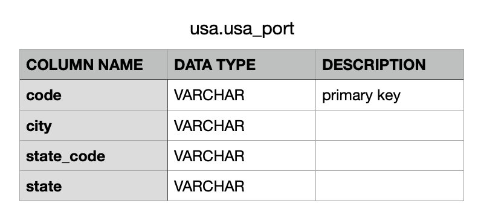

## An automated data pipeline for tourist arrival information in USA.
### Goal of the project
The purpose of this project is to build an ETL pipeline that will be able to provide information to data analysts who want to monitor the tourist arrival information in USA, such as how many foreign students come to USA every day, which city has the most touris arrival the day before etc. 

### Requirements
- jdk 1.8
- python 1.7
- pyspark
- apache-airflow
- psycopg2

### Cloud Service
- Cloud Storage: Amazon Simple Storage Service (Amazon S3)
- Cloud Data Warehouse: Amazon Redshift 

### Dataset
- I94 Immigration Data: data/sas_data/*.parquet
- I94 Immigration Lables Description: data/I94_SAS_Labels_Descriptions.SAS
- U.S. City Demographic Data: data/us-cities-demographics.csv


### Data Exploration 
The I94 Immigration Data comes from the US National Tourism and Trade Office and can be used as data source to acquire the tourist arrival information. In this project, it is provied in multiple **parquet** files, therefore, I use Apache Spark to explore it and find what is really needed. 

#### Clean Data  
- **Reduce Dimensionality** The entire dataset has 28 Features, but not all of them is necessary for the analysis. Therefore, I just choose 11 of them  and add an additional one which from my own view are required to fullfill the purpose of the project 
- **Rename Features** Make the name of features more readable.
- **Covert Type** Assgin the features with right data type.
- **Drop Duplicates** Drop duplicated records 

| Raw Features  | Features (Rename)  | Data Type | Description | 
| -------- | ---------- | --------- |  --------- | 
| admnum | admission_number | INT |   
| i94bir | age | INT |
| gender | gender | VARCHAR |
| i94yr  | arrival_year | INT |
| i94mon | arrival_month | INT |
| arrdate | arrival_date | VARCHAR |
| depdate | departure_date | VARCHAR |
| i94res  | from_country_code | INT | encoded |
| i94port | usa_port_code | VARCHAR | encoded  |
| i94visa | visa_code | INT | encoded |
| i94mode | traval_way | INT | encoded | 
| - | arrival_day | INT | additional added |
| |  | |  | 

#### Exploration Result 
- The data only gives us the tourist information in April, 2016. 
- Some features are encoded. 

#### Data Partitioning
I94 Immigration Data can be splited by `arrival_year`, `arrival_month` and `arrival_day` and saved locally, the path would looks like e.g.:  
- data/raw/i94_immigration_data/arrival_year=2016/arrival_month=4/arrival_day=1/*.parquet

#### Encoding Problem 
After exploration I have found that some features are encoded in the cleaned data and we cannot get all intuive information directly from the I94 Immigration Data. Therefore, we must figure out what the real information is behind the encode. 
- **i94res**: the code description is in I94 Immigration Lables Description, it gives us the country name. **_see_**: data/sas_data_description/i94res.csv
- **i94port**: the code description is in I94 Immigration Lables Description, the description gives us the city name and state code, **_see_**: data/sas_data_description/i94port.csv. (Note: in order to decode state, we also need U.S. City Demographic Data which has the relation between state and state_code.) 
- **i94visa**: the code descrpiotion is in I94 Immigration Lables Description, the description gives us the visa type (pleasure, student and business). **_see_**: data/sas_data_description/i94visa.csv
- **i94mode**: the code descrpiotion is in I94 Immigration Lables Description, the description gives us the travel way (sea, air, landed). **_see_**: data/sas_data_description/i94mode.csv

The raw descriptions are not in a good format, therefore I have reconstructed them and save the well-formated descriptions in:  
- data/raw/i94_immigration_labels_description/i94res.csv  
- data/raw/i94_immigration_labels_description/i94port.csv
- data/raw/i94_immigration_labels_description/i94visa.csv  
- data/raw/i94_immigration_labels_description/i94mode.csv  

### Use Case
Everyday a scheduler can extract **the tourist information the day before** from the raw data set and keep it in a data warehouse. The analysts can then directly access to the data warehouse and get the data to make further analysis, e.g.  
- Which city has the most tourist arrival last day?
- What is the distribution of the tourist arrival in different states the day before?
- How many foreign students have come to USA last week?
- What is the distribution of the tourist type in different state last day?

The tasks can be described in these steps: 
- Prepare raw data (Done in data exploration phase)
- Store raw data in cloud
- Define the data model
- Create a data warehouse
- Build ETL pipeline
    - Stage necessary raw data into the data warehouse 
    - Transform data into a set of dimensional tables 

### Prepare Raw Data 
```bash
run data_exploration.ipynb
```
Note: I have not put the code into a python script(.py) because I think the notebook document is much clearer to show what I have done for data exploration. 

### Store Raw Data in Cloud 
I use Amazon S3 service to store the cleaned and partitioned I94 Immigration Data, and the descriptions. A bucket named `jjq-capstone` has been created and the data has been manully uploaded. 
- data/raw/i94_immigration_data/ -> s3://jjq-capstone/raw/i94_immigration_data
- data/raw/i94_immigration_labels_description -> s3://jjq-capstone/raw/i94_immigration_labels_description

### Define the Data Models 
- schema: usa
- fact table:
    - usa.city_state_travelers_entry: due to the I94 Immigration Data has some encoded features, it is necessary to decode them and give the intuitive value in a table 

- dimension table: 
    - usa.usa_port

    - usa.travel_way

    - usa.visa_code

    - usa.i94country_code

    - usa.arrival_date
    

### Create a data warehouse
I have created a cluster on Amazon Redshift manually. The connection details is saved in `config.cfg`. 
```bash
# create tables 
run create_tables.ipynb  
```

### Build ETL pipeline

I use Apache Airflow to create and automate a set of data pipelines:
- Load data from Amazon S3 to Amazon Redshift Cluster:
    - Stage i94_immigration_data one day before the execution day into a staging table
    - Stage labels descrpition into dimension tables: usa.usa_port, usa.travel_way, usa.visa_code, usa.i94country_code, usa.arrival_date 
- Perform ETL SQL 
    - Insert Data into fact table: city_state_travelers_entry
    - Extract Data from fact table to dimension table: usa.arrival_date

Schedule
- Run once a day at midnight from 01.04.2016 to 30.04.2016

Quality Check
- check if all data has been successfully insert into the tables 

Task Dependencies: 

   

### Analysis Case:
Assume that today were 02.04.2016, we want to know 
-  Which city has the most tourist arrival last day?
```bash
# sql
SELECT COUNT(*) count, city, state, state_code 
FROM usa.city_state_travelers_entry 
WHERE arrival_date = '2016-04-01'
GROUP BY city, state, state_code 
ORDER BY count DESC
LIMIT 1
```
 

- What is the distribution of the type of the tourist in 'new york' the day before?
```bash
# sql 
SELECT COUNT(*) count, visa, city
FROM usa.city_state_travelers_entry 
WHERE arrival_date = '2016-04-01' AND city = 'new york'
GROUP BY visa, city 
```
 

(Note: just access to one table and get all intuitive value)

### Possible Scenarios that may arise and how they can be handled.
- If the data gets increased by 100x:
    -  Redshift: Analytical database, optimized for aggregation, also good performance for read-heavy workloads
    - Cassandra: Is optimized for writes, can be used to write online transactions as it comes in, and later aggregated into analytics tables in Redshift
    - Increase EMR cluster size to handle bigger volume of data
- Pipelines would be run on 7am daily. how to update dashboard? would it still work?
    - DAG retries, or send emails on failures
    - daily intervals with quality checks
    - if checks fail, then send emails to operators, freeze dashboard, look at DAG logs to figure out what went wrong
- Make it available to 100+ people
    - Redshift with auto-scaling capabilities and good read performance
    - Cassandra with pre-defined indexes to optimize read queries
